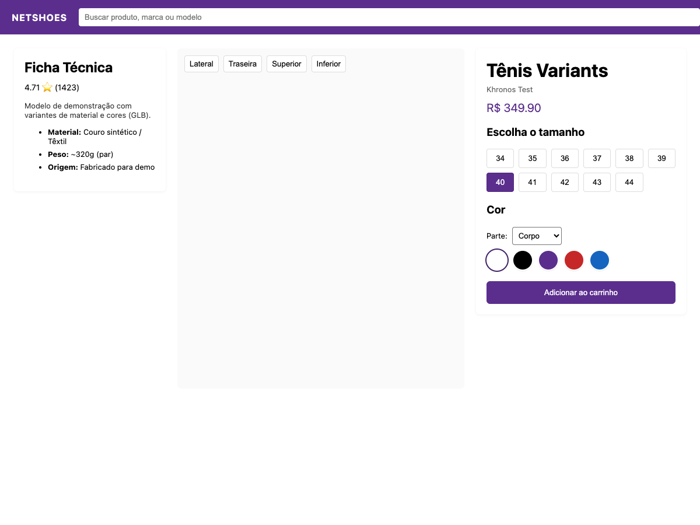

# THESHOES Demo

This is a Vue 2 + Three.js product detail demo application that displays a 3D shoe model with interactive camera views, color selection, and size options.



## What this project is

This repository contains a sample product page for a sneaker product, using a GLB 3D shoe model rendered in a web viewer. The project demonstrates:

- Interactive 3D product display with camera presets
- Color selection and shoe customization UI
- Size selection and dynamic price update
- Responsive product layout with Vue 2 and Three.js

## Requirements

- Node.js 14 or newer

## Run locally

```bash
cd "/Users/caiosantos/Developer/PDP - 3D"
npm install
npm run serve
```

Then open the app in your browser at:

```text
http://localhost:8088/produto/1
```

## Notes

- The 3D model is served from `public/models/MaterialsVariantsShoe.glb`
- Keep `glTF-Sample-Assets` in the workspace if you need additional asset files, but it is treated as a separate Git repository
- If you use `yarn`, replace `npm install` with `yarn` and `npm run serve` with `yarn serve`
